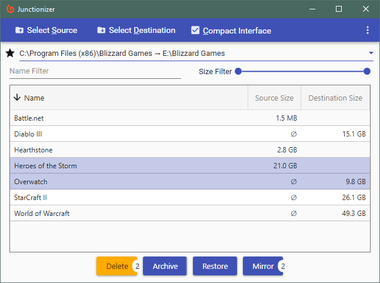

## Junctionizer

Junctionizer is designed for seamlessly moving directories off of your primary drive (ie an SSD with limited space). They are copied to the desired location and then a junction point is created so that the file system can access it from the original location. The primary use case is for managing video game libraries so that less frequently accessed games can be archived to a slower, larger drive without affecting the ability to play them. Inspired by [Steam Mover](http://www.traynier.com/software/steammover) and originally started due to Steam's lack of support for multiple drives.

#### *Features*

- One click operation to archive a directory or restore it to its original location
- View and sort by size to easily find what is using the most space
- Select multiple items for easy batch operations
- Uses the native Windows file copy dialog to provide time estiamtes and allow pausing and cancelling
- Filter by directory name or size
- Store mappings between directories so that you can back up to different locations
- Search your computer for any preexisting junction points
- Double click an item to open it in file explorer

##### Development Notes

PropertyChanged is handled implicitly by Fody [PropertyChanged](https://github.com/Fody/PropertyChanged).